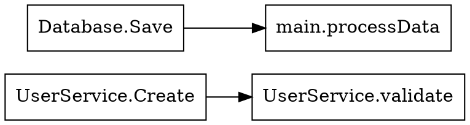

# Cartographer

A Go tool that generates visual dependency maps of Go services by analyzing function and method call relationships.

## Features

- **Fine-Grained Analysis**: Maps every function and method in your codebase
- **Method Labeling**: Methods are labeled with their receiver type (e.g., `UserService.Create`)
- **Call Relationships**: Shows directed edges for all internal function/method calls
- **Smart Filtering**: Automatically excludes test files and vendor directories
- **AI Explanations**: Optional AI-powered code summaries with persistent caching
- **Graphviz Output**: Generates DOT format for visualization

## Usage

```bash
# Analyze current directory
./cartographer

# Analyze specific directory
./cartographer -dir /path/to/project

# With AI explanations (requires GROQ_API_KEY)
GROQ_API_KEY=your_key ./cartographer -dir /path/to/project
```

## Building

```bash
go build -o cartographer .
```

## Example Output

The tool generates Graphviz DOT format output showing the call graph:



## AI Features

- **Caching**: Uses SQLite database (`.cartographer_cache.db`) for persistent caching
- **Cost Efficiency**: 95% cache hit rate on unchanged codebases
- **Explanations**: AI-generated tooltips embedded in DOT output

## Limitations

- Uses AST parsing without full type information
- May not capture all dynamic calls or interface method calls
- Field method calls (e.g., `u.db.Save()`) use heuristics for type inference
- AI explanations limited to 100 nodes for experimentation
